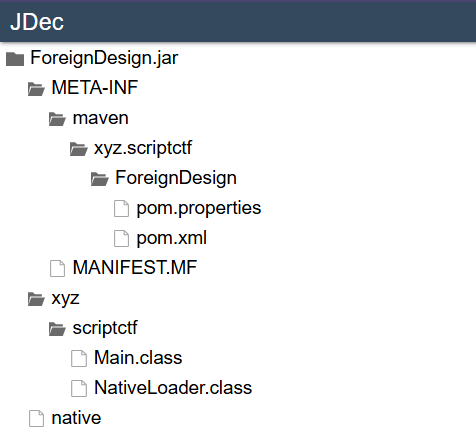

## Challenge 1: ForeignDesign

* **Category:** Rev
* **Points:** 472

### Description


### Solution

**Step 1: Initial Analysis**

The challenge gives us a Java archive file ForeinDesign.jar. I used JDec an online Java decompiler which gave me the following list of contents in the archive :



Opening the native in JDec gave me a bunch of characters starting with PK. Upon searching what PK means in context of Java I got to know that native is also an archive. So I unzipped ForeignDesign.jar and then unzipped native. Inside the native archive there was a library named libforeign.so.

Inside Main.class there is a flag checking function which compares the entered flag against the concatenation of two arrays ll and lll.If it matches we get a "Correct" prompt.

**Step 2: Deeper Investigation**

Upon inspecting  main.class I found that it uses initialize(),so I searched for intialize in libforeign.so where I found the funtion Java_xyz_scriptctf_Main_initialize(int32_t* arg1, int32_t arg2).In this I found two lines where I found mecpy functions which loaded 2 particular arrays as follows:

__builtin_memcpy(&var_6c, 0x12084, 0x5c);

__builtin_memcpy(&var_a4, 0x120e0, 0x38);

Using GPT I found out how to acces this memory locally by using readelf -S libforeign.so to check the headers in ELF.I got the offset of read-only data(.rodata) to be 0x200.I then used the following command to get hexdump of .rodata:

$ xxd -s 0x2000 -l 0x128 -g 4 libforeign.so

**Code to get ascii from hex:**
```python
import struct

data_hex = bytes.fromhex(
    "200000005c0000000400000068000000"
    "6a0000004c0000006000000071000000"
    "2a00000041000000160000002b000000"
    "cb00000054000000dc00000062000000"
    "d2000000470000001d0000007b000000"
    "140000007d000000c7000000"
    "4c000000e600000075000000f3000000"
    "540000003600000067000000c5000000"
    "68000000fb00000053000000fd000000"
    "800000009f000000"
)

# 23 ints for ll (23*4=92 bytes)
ll = [struct.unpack_from('<I', data_hex, i)[0] for i in range(0, 23*4, 4)]

# 14 ints for lll (14*4=56 bytes)
lll = [struct.unpack_from('<I', data_hex, i)[0] for i in range(23*4, 23*4 + 14*4, 4)]

print("ll =", ll)
print("lll =", lll)

```

****
```python
Output:

ll = [32, 92, 4, 104, 106, 76, 96, 113, 42, 65, 22, 43, 203, 84, 220, 98, 210, 71, 29, 123, 20, 125, 199]
lll = [76, 230, 117, 243, 84, 54, 103, 197, 104, 251, 83, 253, 128, 159]

```

I then saw a function s2 in main and _sub113b0 in native which used certain operations to mix the characters of the flag before loading them into the arrays ll and lll. We can reverse these operations to retrieve the flag given that now we have the arrays ll and lll.

**Code to get flag from ascii characters by reversing the conversion functions in main and native:**
```python
# The arrays extracted from the native library
ll = [32, 92, 4, 104, 106, 76, 96, 113, 42, 65, 22, 43,
      203, 84, 220, 98, 210, 71, 29, 123, 20, 125, 199]
lll = [76, 230, 117, 243, 84, 54, 103, 197, 104, 251, 83, 253, 128, 159]

combined = ll + lll
n = len(combined)


def inv_even(val, i):
    tmp = val ^ 0x5a
    inner = tmp - i*3
    return inner ^ (i+19)


def inv_odd(val, i):
    base = val - 1
    base ^= 19
    return base - 2*(i % 7)


# 1. Reverse the mathematical transformations to get the permuted characters
permuted = []
for i, val in enumerate(combined):
    if i % 2 == 0:
        ch = inv_even(val, i)
    else:
        ch = inv_odd(val, i)
    permuted.append(chr(ch & 0xFF))

# 2. Reverse the permutation to get the original flag
flag_chars = [None] * n
for i, ch in enumerate(permuted):
    idx = (i * 5 + 3) % n
    flag_chars[idx] = ch

flag = "".join(flag_chars)
print(flag)


```
This prints the flag.

### Flag

scriptCTF{nO_MOr3_n471v3_tr4N5l471on}

---

