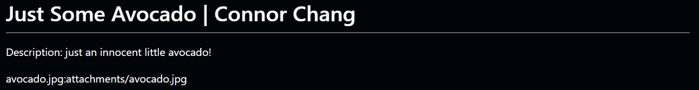
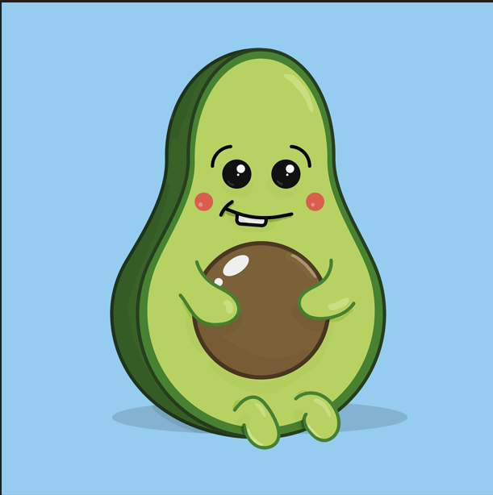
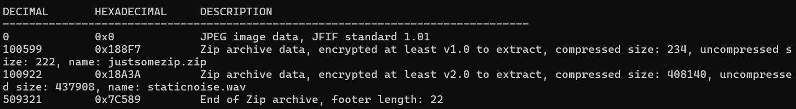
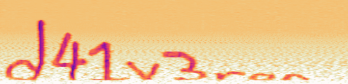

## Challenge 3: JustSomeAvocado

* **Category:** Forensics

### Description

### Solution

The challenege gives us a .jpg file avocado.jpg. The image itself contains a cartoon avocado.The obvious next step was to run binwalk to check for hidden data and we get a zip file hidden in it.

Extracting the zip file and trying to unzip it reveals that we need a password to do so. Since no other hints were given in the challenge I used John the ripper on rockyou.txt to get the password for the zip.

Unzipping it, we get another zip file and a .wav file. The new zip file is also password protected. I opened the .wav file in audacity spectrogram mode and found the password to the zip file written there.

Open the zip file and find the flag hidden there.

### Flag

scriptCTF{nO_MOr3_n471v3_tr4N5l471on}

---
