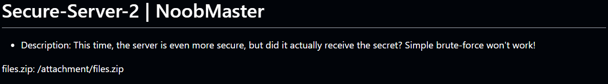
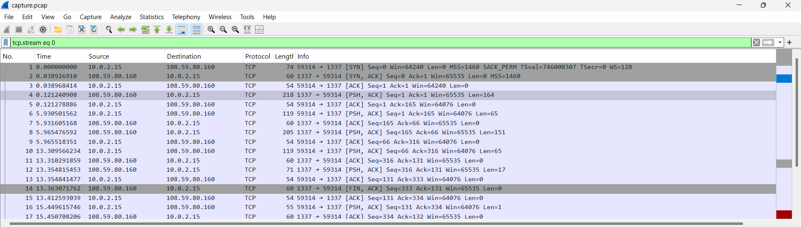
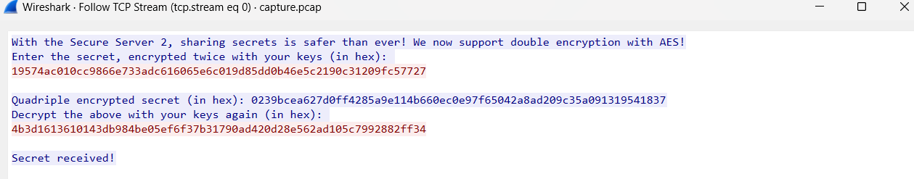

## Challenge 2: Secure-Server-2

* **Category:** Crypto

### Description



### Solution

**Step 1: Initial Analysis**

This challenge has an attachment files.zip which contains 3 files:

1) capture.pcap (A network capture file)

2) johndoe.py

3) server.py



Opening the network capture file in WireShark , I found the above streams. Choosing the stream with the largest length (218), I found the coded messages being sent as per the methods in johndoe.py and server.py.



**Step 2: Reversing Encryption**

The server workflow is basically:


c1 = k2(k1(secret))

c2 = k4(k3(c1))

c3 = k1(inv)(k2(inv)(c2))


So we are given three values:

c1: result after keys (k1, k2)

c2: result after all four keys (k1, k2, k3, k4)

c3: result after inverting (k1, k2) from c2

Each key (k1,k2,k3,k4) is 2 bytes long , simple brute force like done in secure server 1 wont work . I searched how double AES encryptions may be broken and found Meet-in-the-middle attacks.We use the third equation relating c3 and c2 and encrpyt both side with k1 to get 

k1(c3)=k2(inv)(c2)

Iterate all possible k1s to build a table t1 which stores the encrypted c3.Similarly iterate through all possible k2s and check the table t1 to see if the decrypted c2 matches any encrypted c3 to get the pair (k1,k2).

Similarly get k3 and k4.

**Code to get flag from c1 c2 c3:**
```python

from Crypto.Cipher import AES

def make_key(x):
    b1 = bin(x[0])[2:].zfill(8)
    b2 = bin(x[1])[2:].zfill(8)
    return (b1 + b2).encode()

c1 = bytes.fromhex("19574ac010cc9866e733adc616065e6c019d85dd0b46e5c2190c31209fc57727")
c2 = bytes.fromhex("0239bcea627d0ff4285a9e114b660ec0e97f65042a8ad209c35a091319541837")
c3 = bytes.fromhex("4b3d1613610143db984be05ef6f37b31790ad420d28e562ad105c7992882ff34")

t1 = {}
for i in range(65536):
    k1 = i.to_bytes(2)
    aes = AES.new(make_key(k1), AES.MODE_ECB)
    t1[aes.encrypt(c3)] = k1

k1 = k2 = None
for j in range(65536):
    temp = j.to_bytes(2)
    aes = AES.new(make_key(temp), AES.MODE_ECB)
    val = aes.decrypt(c2)
    if val in t1:
        k1 = t1[val]
        k2 = temp
        break

t2 = {}
for i in range(65536):
    k3 = i.to_bytes(2)
    aes = AES.new(make_key(k3), AES.MODE_ECB)
    t2[aes.encrypt(c1)] = k3

k3 = k4 = None
for j in range(65536):
    temp = j.to_bytes(2)
    aes = AES.new(make_key(temp), AES.MODE_ECB)
    val = aes.decrypt(c2)
    if val in t2:
        k3 = t2[val]
        k4 = temp
        break

k2aes = AES.new(make_key(k2), AES.MODE_ECB)
k1aes = AES.new(make_key(k1), AES.MODE_ECB)
secret = k1aes.decrypt(k2aes.decrypt(c1))
flag = secret.decode().strip() + k1.decode() + k2.decode() + k3.decode() + k4.decode()
print(flag)


```

****

This prints the flag.

### Flag

scriptCTF{s3cr37_m3ss4g3_1337!_7e4b3f8d}

---

